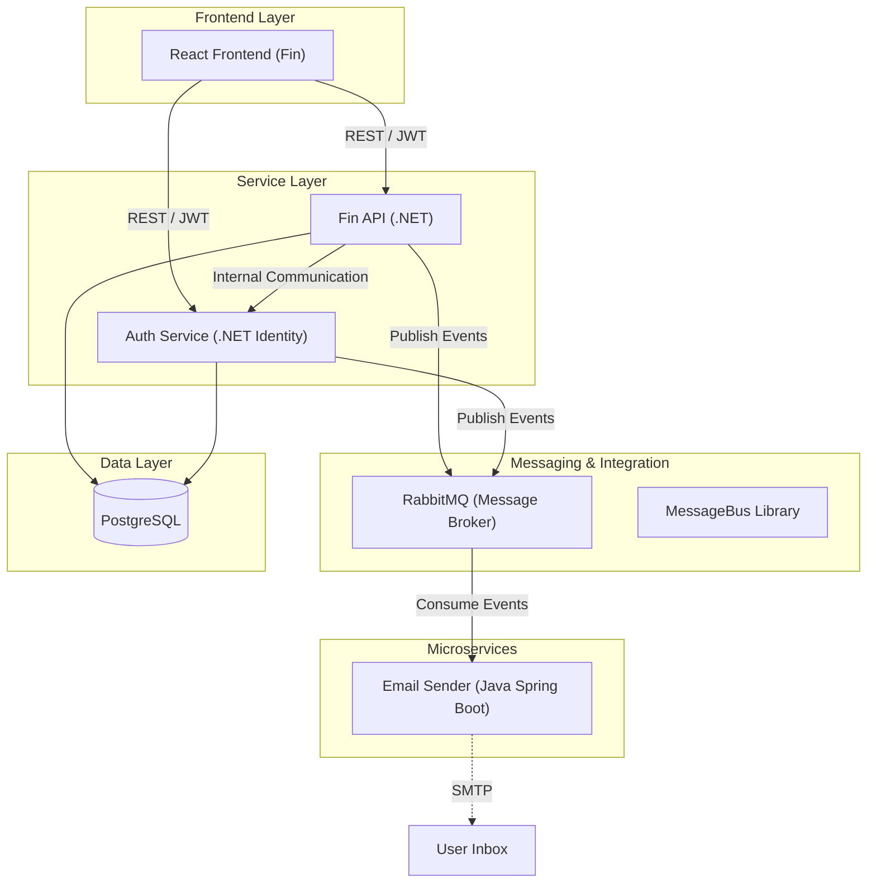
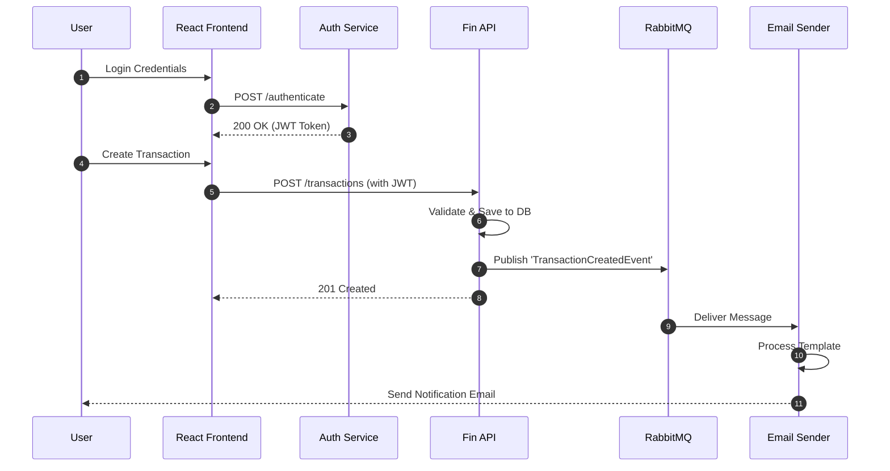

# FinControl System

FinControl System is a professional, modular distributed platform designed for comprehensive financial management. The system is built using a microservices-oriented architecture, leveraging a diverse technology stack including .NET, Java, and React to ensure scalability, maintainability, and high performance.

The platform enables users to manage financial transactions, categorize expenses, and receive automated notifications, all within a secure environment powered by JWT authentication and event-driven communication.

---

## 1. System Architecture

The FinControl System follows a distributed architecture where services are decoupled and communicate through standardized interfaces. The architecture prioritizes separation of concerns, with dedicated services for business logic, identity management, and background processing.

### High-Level Architecture Flow



---

## 2. Repository Structure

This repository acts as a **system orchestrator**, utilizing **Git submodules** to aggregate independent services into a single unified workspace.

```text
fincontrol-system (Root)
│
├── fin-api          # Main Backend (Business Logic)
├── auth             # Identity & Access Management
├── email-sender     # Asynchronous Notification Service
├── messagebus       # Shared Messaging Library
└── fin              # React TypeScript Frontend
```

---

## 3. Services Description

### 💰 Fin API
The core backend service responsible for financial operations. It manages accounts, transactions, and categories, enforcing business rules and ensuring data integrity. It integrates with the MessageBus to trigger external actions based on financial events.

### 🔐 Auth Service
A dedicated security service built on ASP.NET Core Identity. It handles user registration, authentication, and token issuance (JWT). It ensures that all communication within the ecosystem is secure and authorized.

### 📧 Email Sender
A Java Spring Boot microservice that operates as a background consumer. It listens to specific queues in RabbitMQ and dispatches email notifications (e.g., welcome emails, transaction alerts) asynchronously, ensuring the main APIs remain responsive.

### 🚌 MessageBus
A specialized .NET library that standardizes integration patterns across the ecosystem. It provides a robust abstraction over RabbitMQ, facilitating the "Publish-Subscribe" pattern for event-driven communication.

### 💻 Fin (Frontend)
A modern, responsive user interface built with React and TypeScript. It provides a seamless experience for users to interact with their financial data, featuring real-time updates and interactive dashboards.

---

## 4. Technologies Used

| Category | Technologies |
| :--- | :--- |
| **Backend** | .NET 8, ASP.NET Core, Java 17, Spring Boot |
| **Frontend** | React, TypeScript, Vite, CSS/Styled Components |
| **Messaging** | RabbitMQ |
| **Database** | PostgreSQL, Entity Framework Core (EF Core) |
| **DevOps** | Docker, Docker Compose |
| **Auth** | JWT (JSON Web Tokens), ASP.NET Identity |

---

## 5. System Flow

The following sequence diagram illustrates the standard flow for a secure transaction that triggers a notification:



---

## 6. Running the System Locally

### Prerequisites
* [Docker Desktop](https://www.docker.com/products/docker-desktop/)
* [.NET 8 SDK](https://dotnet.microsoft.com/download/dotnet/8.0)
* [Java 17 (JDK)](https://adoptium.net/)
* [Node.js (v18+)](https://nodejs.org/)

### Setup Instructions

1.  **Clone the repository with submodules:**
    ```bash
    git clone --recurse-submodules https://github.com/jovannesousa/fincontrol-system.git
    cd fincontrol-system
    ```

2.  **Initialize/Update submodules (if cloned without `--recurse-submodules`):**
    ```bash
    git submodule update --init --recursive
    ```

3.  **Infrastructure (Database & Messaging):**
    Use Docker Compose to spin up the required infrastructure:
    ```bash
    docker-compose up -d
    ```

4.  **Running Services:**
    Each service can be started from its respective directory:
    * **Auth/Fin API:** `dotnet run` inside the project folders.
    * **Email Sender:** `./mvnw spring-boot:run`
    * **Frontend:** `npm install && npm run dev`

---

## 7. Development Notes

*   **Service Independence:** Each module is a self-contained repository and can be deployed or scaled independently.
*   **Asynchronous Patterns:** The system heavily utilizes asynchronous messaging to decouple high-latency tasks (like email sending) from the user-facing request cycle.
*   **Security:** All API endpoints (except login/register) require a valid Bearer Token issued by the Auth Service.
*   **Extensibility:** The modular nature of the architecture allows for new consumers (e.g., SMS sender, Analytics service) to be added simply by subscribing to existing RabbitMQ exchanges.

---
Developed by [Jovanne Sousa](https://github.com/jovannesousa)
