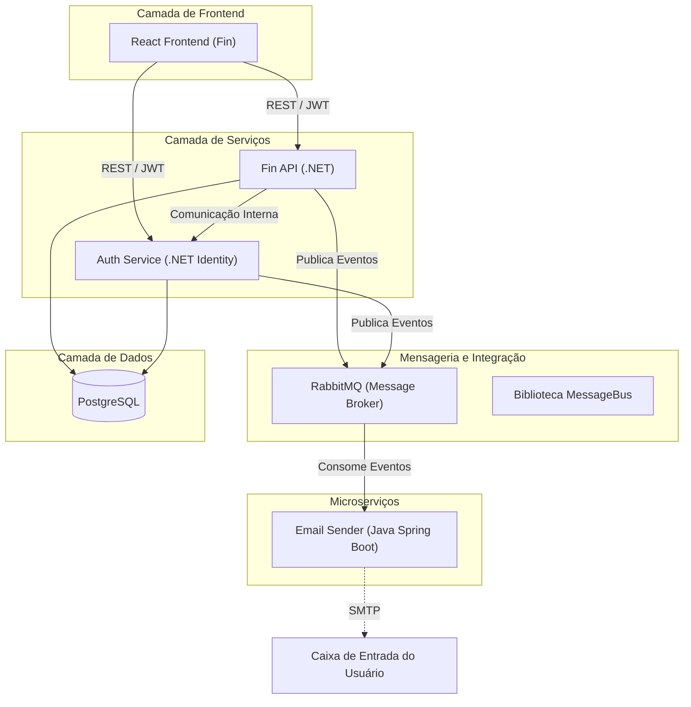
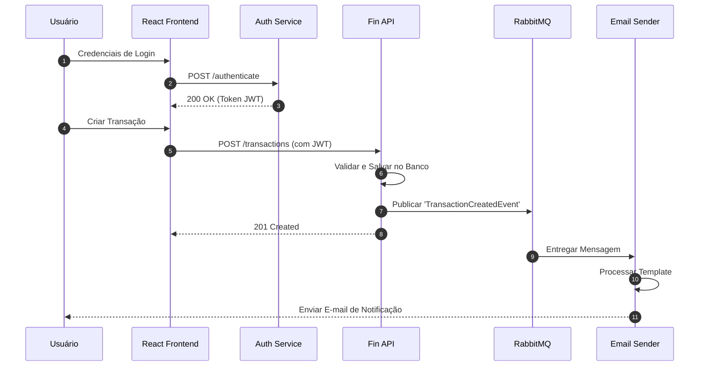

# FinControl System

O FinControl System é uma plataforma profissional e modular de gestão financeira distribuída. O sistema foi construído utilizando uma arquitetura orientada a microserviços, aproveitando uma pilha tecnológica diversificada que inclui .NET, Java e React para garantir escalabilidade, manutenibilidade e alta performance.

A plataforma permite que os usuários gerenciem transações financeiras, categorizem despesas e recebam notificações automatizadas, tudo dentro de um ambiente seguro alimentado por autenticação JWT e comunicação baseada em eventos.

---

## 1. Arquitetura do Sistema

O FinControl System segue uma arquitetura distribuída onde os serviços são desacoplados e se comunicam através de interfaces padronizadas. A arquitetura prioriza a separação de responsabilidades, com serviços dedicados para lógica de negócio, gerenciamento de identidade e processamento em segundo plano.

### Fluxo de Arquitetura de Alto Nível



---

## 2. Estrutura do Repositório

Este repositório atua como um **orquestrador do sistema**, utilizando **Git submodules** para agregar serviços independentes em um único espaço de trabalho unificado.

```text
fincontrol-system (Raiz)
│
├── fin-api          # Backend Principal (Lógica de Negócio)
├── auth             # Gerenciamento de Identidade e Acesso
├── email-sender     # Serviço de Notificação Assíncrona
├── messagebus       # Biblioteca de Mensageria Compartilhada
└── fin              # Frontend em React TypeScript
```

---

## 3. Descrição dos Serviços

### 💰 Fin API
O serviço backend principal responsável pelas operações financeiras. Gerencia contas, transações e categorias, aplicando regras de negócio e garantindo a integridade dos dados. Integra-se com o MessageBus para disparar ações externas baseadas em eventos financeiros.

### 🔐 Auth Service
Um serviço de segurança dedicado construído com ASP.NET Core Identity. Responsável pelo registro de usuários, autenticação e emissão de tokens (JWT). Garante que toda a comunicação dentro do ecossistema seja segura e autorizada.

### 📧 Email Sender
Um microserviço Java Spring Boot que opera como um consumidor em segundo plano. Ele escuta filas específicas no RabbitMQ e envia notificações por e-mail (ex: e-mails de boas-vindas, alertas de transação) de forma assíncrona, garantindo que as APIs principais permaneçam responsivas.

### 🚌 MessageBus
Uma biblioteca .NET especializada que padroniza os padrões de integração em todo o ecossistema. Fornece uma abraçãom robusta sobre o RabbitMQ, facilitando o padrão "Publish-Subscribe" para comunicação baseada em eventos.

### 💻 Fin (Frontend)
Uma interface de usuário moderna e responsiva construída com React e TypeScript. Oferece uma experiência fluida para os usuários interagirem com seus dados financeiros, apresentando atualizações em tempo real e dashboards interativos.

---

## 4. Tecnologias Utilizadas

| Categoria | Tecnologias |
| :--- | :--- |
| **Backend** | .NET 8, ASP.NET Core, Java 17, Spring Boot |
| **Frontend** | React, TypeScript, Vite, CSS/Styled Components |
| **Mensageria** | RabbitMQ |
| **Banco de Dados** | PostgreSQL, Entity Framework Core (EF Core) |
| **Infraestrutura** | Docker, Docker Compose |
| **Segurança** | JWT (JSON Web Tokens), ASP.NET Identity |

---

## 5. Fluxo do Sistema

O diagrama de sequência a seguir ilustra o fluxo padrão para uma transação segura que dispara uma notificação:



---

## 6. Executando o Sistema Localmente

### Pré-requisitos
* [Docker Desktop](https://www.docker.com/products/docker-desktop/)
* [.NET 8 SDK](https://dotnet.microsoft.com/download/dotnet/8.0)
* [Java 17 (JDK)](https://adoptium.net/)
* [Node.js (v18+)](https://nodejs.org/)

### Instruções de Configuração

1.  **Clone o repositório com os sub-módulos:**
    ```bash
    git clone --recurse-submodules https://github.com/jovannesousa/fincontrol-system.git
    cd fincontrol-system
    ```

2.  **Inicialize/Atualize os sub-módulos (caso tenha clonado sem `--recurse-submodules`):**
    ```bash
    git submodule update --init --recursive
    ```

3.  **Infraestrutura (Banco de Dados e Mensageria):**
    Utilize o Docker Compose para subir a infraestrutura necessária:
    ```bash
    docker-compose up -d
    ```

4.  **Executando os Serviços:**
    Cada serviço pode ser iniciado a partir de seu respectivo diretório:
    * **Auth/Fin API:** `dotnet run` dentro das pastas dos projetos.
    * **Email Sender:** `./mvnw spring-boot:run`
    * **Frontend:** `npm install && npm run dev`

---

## 7. Notas de Desenvolvimento

*   **Independência de Serviços:** Cada módulo é um repositório autônomo e pode ser implantado ou escalado de forma independente.
*   **Padrões Assíncronos:** O sistema utiliza intensamente mensageria assíncrona para desacoplar tarefas de alta latência (como envio de e-mail) do ciclo de requisição do usuário.
*   **Segurança:** Todos os endpoints da API (exceto login/registro) exigem um Bearer Token válido emitido pelo Auth Service.
*   **Extensibilidade:** A natureza modular da arquitetura permite que novos consumidores (ex: serviço de SMS, serviço de Analytics) sejam adicionados simplesmente assinando as exchanges existentes do RabbitMQ.

---
Desenvolvido por [Jovanne Sousa](https://github.com/jovannesousa)
